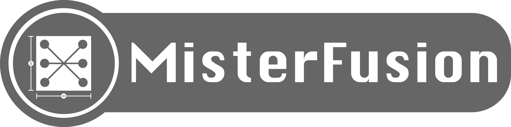
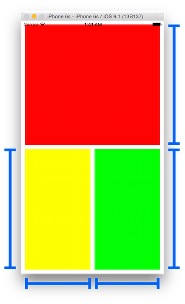
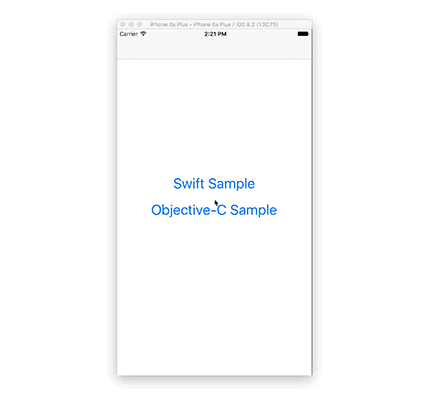
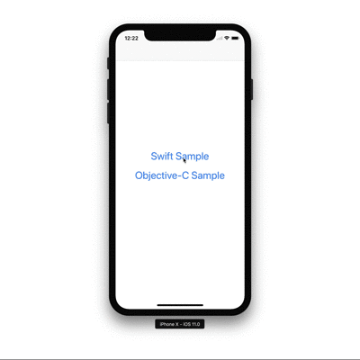

# MisterFusion

[](https://developer.apple.com/iphone/index.action)
[](https://developer.apple.com/swift)
[](http://cocoapods.org/pods/MisterFusion)
[](https://github.com/Carthage/Carthage)
[](http://cocoapods.org/pods/MisterFusion)
[](https://travis-ci.org/marty-suzuki/MisterFusion)

[ManiacDev.com](https://maniacdev.com/) referred.  
[https://maniacdev.com/2015/12/open-source-auto-layout-library-with-a-simple-and-concise-syntax](https://maniacdev.com/2015/12/open-source-auto-layout-library-with-a-simple-and-concise-syntax)



MisterFusion makes more easier to use AutoLayout in Swift & Objective-C code.

## Features
- [x] Simple And Concise Syntax
- [x] Use in Swift and Objective-C
- [x] Support Size Class
- [x] Support Swift4
- [x] Support SafeArea🎉 (Swift3.2 since 2.3.1, Swift4 since 3.1.0)

#### MisterFusion Code for Swift

```swift
let view = UIView()
self.view.mf.addSubview(view, andConstraints:
    view.top    |+| 10,
    view.right  |-| 10,
    view.left   |+| 10,
    view.bottom |-| 10
)
```

#### Ordinary Code for Swift

This is same implementation as above code, but this is hard to see.

```swift
let view = UIView()
self.view.addSubview(view)
view.translatesAutoresizingMaskIntoConstraints = false
self.view.addConstraints([
    NSLayoutConstraint(item: view, attribute: .top,    relatedBy: .equal, toItem: self.view, attribute: .top,    multiplier: 1, constant:  10),
    NSLayoutConstraint(item: view, attribute: .right,  relatedBy: .equal, toItem: self.view, attribute: .right,  multiplier: 1, constant: -10),
    NSLayoutConstraint(item: view, attribute: .left,   relatedBy: .equal, toItem: self.view, attribute: .left,   multiplier: 1, constant:  10),
    NSLayoutConstraint(item: view, attribute: .bottom, relatedBy: .equal, toItem: self.view, attribute: .bottom, multiplier: 1, constant: -10),
])
```

#### MisterFusion Code for Objective-C

```objective-c
UIView *view = [UIView new];
[self.view addLayoutSubview:view andConstraints:@[
    view.Top   .Constant(10.0f),
    view.Right .Constant(-10.0f),
    view.Left  .Constant(10.0f),
    view.Bottom.Constant(-10.0f)
]];
```

#### Ordinary Code for Objective-C

This is same implementation as above code, but this is hard to see.

```objective-c
UIView *view = [UIView new];
view.translatesAutoresizingMaskIntoConstraints = NO;
[self.view addSubview: view];
[self.view addConstraints:@[
    [NSLayoutConstraint constraintWithItem:view attribute:NSLayoutAttributeTop    relatedBy:NSLayoutRelationEqual toItem:self.view attribute:NSLayoutAttributeTop    multiplier:1.0f constant:10.0f],
    [NSLayoutConstraint constraintWithItem:view attribute:NSLayoutAttributeRight  relatedBy:NSLayoutRelationEqual toItem:self.view attribute:NSLayoutAttributeRight  multiplier:1.0f constant:-10.0f],
    [NSLayoutConstraint constraintWithItem:view attribute:NSLayoutAttributeLeft   relatedBy:NSLayoutRelationEqual toItem:self.view attribute:NSLayoutAttributeLeft   multiplier:1.0f constant:10.0f],
    [NSLayoutConstraint constraintWithItem:view attribute:NSLayoutAttributeHeight relatedBy:NSLayoutRelationEqual toItem:self.view attribute:NSLayoutAttributeHeight multiplier:0.5f constant:-15.0f]
]];
```

#### Sample Layout



If you want to realize layout like a above image, needed code is only this.

```swift
let redView = UIView()
redView.backgroundColor = .red
self.view.mf.addSubview(redView, andConstraints:
    redView.top   |+| 10,
    redView.right |-| 10,
    redView.left  |+| 10
)

let yellowView = UIView()
yellowView.backgroundColor = .yellow
self.view.mf.addSubview(yellowView, andConstraints:
    yellowView.top    |==| redView.bottom |+| 10,
    yellowView.left   |+|  10,
    yellowView.bottom |-|  10,
    yellowView.height |==| redView.height
)

let greenView = UIView()
greenView.backgroundColor = .green
self.view.mf.addSubview(greenView, andConstraints:
    greenView.top    |==| redView.bottom    |+| 10,
    greenView.left   |==| yellowView.right  |+| 10,
    greenView.bottom |-|  10,
    greenView.right  |-|  10,
    greenView.width  |==| yellowView.width,
    greenView.height |==| yellowView.height
)
```

## Installation

#### CocoaPods

MisterFusion is available through [CocoaPods](http://cocoapods.org). If you have cocoapods 0.39.0 or greater, you can install
it, simply add the following line to your Podfile:

	pod 'MisterFusion'

In addtion, import **MisterFusion** like this.

##### Swift

    import MisterFusion

##### Objective-C

    #import <MisterFusion/MisterFusion-Swift.h>

#### Carthage

If you’re using [Carthage](https://github.com/Carthage/Carthage), simply add
MisterFusion to your `Cartfile`:

```
github "szk-atmosphere/MisterFusion"
```
Make sure to add `MisterFusion.framework` to "Linked Frameworks and Libraries" and "copy-frameworks" Build Phases.

## Advanced Setting

You can set `multiplier`, `constant` and `priority` like this.
(This is same implementation as [first example](#misterfusion-code-for-swift).)

#### Swift

```swift
self.view.mf.addSubview(view, andConstraints:
    view.top    |==| self.view.top    |*| 1 |+| 10 |<>| UILayoutPriorityRequired,
    view.right  |==| self.view.right  |*| 1 |-| 10 |<>| UILayoutPriorityRequired,
    view.left   |==| self.view.left   |*| 1 |+| 10 |<>| UILayoutPriorityRequired,
    view.bottom |==| self.view.bottom |*| 1 |-| 10 |<>| UILayoutPriorityRequired
)
```

#### Objective-C

```objective-c
[self.view addLayoutSubview:view andConstraints:@[
    view.Top   .Equal(self.view.Top)   .Multiplier(1.0f).Constant(10.0f) .Priority(UILayoutPriorityRequired),
    view.Right .Equal(self.view.Right) .Multiplier(1.0f).Constant(-10.0f).Priority(UILayoutPriorityRequired),
    view.Left  .Equal(self.view.Left)  .Multiplier(1.0f).Constant(10.0f) .Priority(UILayoutPriorityRequired),
    view.Bottom.Equal(self.view.Bottom).Multiplier(1.0f).Constant(-10.0f).Priority(UILayoutPriorityRequired)
]];
```

## For Swift

#### Operators

- `|==|`, `|<=|`, `|>=|` ... `NSLayoutRelation` and fixed `height` and `width`
- `|*|`, `|/|` ... `multiplier`
- `|+|`, `|-|` ... `constant`
- `|<>|` ... `UILayoutPriority`
- `<|>` ... `UIUserInterfaceSizeClass` for VerticalSizeClass
- `<->` ... `UIUserInterfaceSizeClass` for HorizontalSizeClass
- `-=-` ... Identifier

#### UIView Extensions

```swift
public func addLayoutConstraint(_ misterFusion: MisterFusion) -> NSLayoutConstraint?
public func addLayoutConstraints(_ misterFusions: MisterFusion...) -> [NSLayoutConstraint]
public func addLayoutConstraints(_ misterFusions: [MisterFusion]) -> [NSLayoutConstraint]
public func addLayoutSubview(_ subview: UIView, andConstraint misterFusion: MisterFusion) -> NSLayoutConstraint?
public func addLayoutSubview(_ subview: UIView, andConstraints misterFusions: [MisterFusion]) -> [NSLayoutConstraint]
public func addLayoutSubview(_ subview: UIView, andConstraints misterFusions: MisterFusion...) -> [NSLayoutConstraint]
public func insertLayoutSubview(_ subview: UIView, at index: Int, andConstraint misterFusion: MisterFusion) -> NSLayoutConstraint?
public func insertLayoutSubview(_ subview: UIView, at index: Int, andConstraints misterFusions: [MisterFusion]) -> [NSLayoutConstraint]
public func insertLayoutSubview(_ subview: UIView, at index: Int, andConstraints misterFusions: MisterFusion...) -> [NSLayoutConstraint]
public func insertLayoutSubview(_ subview: UIView, belowSubview siblingSubview: UIView, andConstraint misterFusion: MisterFusion) -> NSLayoutConstraint?
public func insertLayoutSubview(_ subview: UIView, belowSubview siblingSubview: UIView, andConstraints misterFusions: [MisterFusion]) -> [NSLayoutConstraint]
public func insertLayoutSubview(_ subview: UIView, belowSubview siblingSubview: UIView, andConstraints misterFusions: MisterFusion...) -> [NSLayoutConstraint]
public func insertLayoutSubview(_ subview: UIView, aboveSubview siblingSubview: UIView, andConstraint misterFusion: MisterFusion) -> NSLayoutConstraint?
public func insertLayoutSubview(_ subview: UIView, aboveSubview siblingSubview: UIView, andConstraints misterFusions: [MisterFusion]) -> [NSLayoutConstraint]
public func insertLayoutSubview(_ subview: UIView, aboveSubview siblingSubview: UIView, andConstraints misterFusions: MisterFusion...) -> [NSLayoutConstraint]
```

#### Array Extensions

```swift
public func firstItem(_ view: UIView) -> [NSLayoutConstraint]    
public func firstAttribute(_ attribute: NSLayoutAttribute) -> [NSLayoutConstraint]   
public func relation(_ relation: NSLayoutRelation) -> [NSLayoutConstraint]  
public func secondItem(_ view: UIView) -> [NSLayoutConstraint]    
public func secondAttribute(_ attribute: NSLayoutAttribute) -> [NSLayoutConstraint]
```

You can get added `NSLayoutConstraint` with those functions.
This is a example.

```swift
let bottomConstraint: NSLayoutConstraint = self.view.addLayoutSubview(view, andConstraints:
    view.top    |+| 10,
    view.right  |-| 10,
    view.left   |+| 10,
    view.bottom |-| 10
).firstAttribute(.bottom).first
```

You can use `Size Class` with `func traitCollectionDidChange(previousTraitCollection: UITraitCollection?)`.



This is an example Regular, Compact size for iPhone6s+.

```swift
override func traitCollectionDidChange(previousTraitCollection: UITraitCollection?) {
    guard let whiteView = whiteView, redView = redView else { return }
    if let whiteViewHeightConstraint = whiteViewWidthConstraint {
        redView.removeConstraint(whiteViewHeightConstraint)
    }
    self.whiteViewWidthConstraint = redView.mf.addConstraints(
        whiteView.width |-| 20 <|> .compact <-> .regular,
        whiteView.width |*| 0.5 |-| 10 <|> .regular <-> .compact
    ).firstAttribute(.width).first
}
```

* A detail sample is [here](./Example/MisterFusionSample/ViewController.swift)

#### Safe Area

You can use `view.safeArea.top` and so on. This is supported Safe Area.

```swift
view.mf.addConstraints(
    yellowView.top    |==| redView.bottom       |+| 10,
    yellowView.right  |==| view.safeArea.right  |-| 10,
    yellowView.left   |==| view.safeArea.left   |+| 10,
    yellowView.height |==| view.safeArea.height |/| 2 |-| 15
)
```
If OS version is below iOS 11, `view.safeArea.top` returns `view.top` internally.



Those are accessible safeArea properties.

```swift
extension UIView {
    public var safeArea: SafeAreaExtension { get }
}

extension SafeAreaExtension where Base: UIView {
    public var top: MisterFusion { get }
    public var right: MisterFusion { get }
    public var left: MisterFusion { get }
    public var bottom: MisterFusion { get }
    public var height: MisterFusion { get }
    public var width: MisterFusion { get }
    public var leading: MisterFusion { get }
    public var trailing: MisterFusion { get }
    public var centerX: MisterFusion { get }
    public var centerY: MisterFusion { get }
    public var notAnAttribute: MisterFusion { get }
    public var lastBaseline: MisterFusion { get }
    public var firstBaseline: MisterFusion { get }
    public var leftMargin: MisterFusion { get }
    public var rightMargin: MisterFusion { get }
    public var topMargin: MisterFusion { get }
    public var bottomMargin: MisterFusion { get }
    public var leadingMargin: MisterFusion { get }
    public var trailingMargin: MisterFusion { get }
    public var centerXWithinMargins: MisterFusion { get }
    public var centerYWithinMargins: MisterFusion { get }
}
```

## For Objective-C

### Readonly Blocks

```objective-c
@interface MisterFusion : NSObject
//NSLayoutRelation
@property (nonatomic, readonly, copy) MisterFusion * __nullable (^ __nonnull Equal)(MisterFusion * __nonnull);
@property (nonatomic, readonly, copy) MisterFusion * __nullable (^ __nonnull LessThanOrEqual)(MisterFusion * __nonnull);
@property (nonatomic, readonly, copy) MisterFusion * __nullable (^ __nonnull GreaterThanOrEqual)(MisterFusion * __nonnull);
//multiplier
@property (nonatomic, readonly, copy) MisterFusion * __nullable (^ __nonnull Multiplier)(CGFloat);
//constant
@property (nonatomic, readonly, copy) MisterFusion * __nullable (^ __nonnull Constant)(CGFloat);
@property (nonatomic, readonly, copy) MisterFusion * __nullable (^ __nonnull NotRelatedEqualConstant)(CGFloat);
@property (nonatomic, readonly, copy) MisterFusion * __nullable (^ __nonnull NotRelatedLessThanOrEqualConstant)(CGFloat);
@property (nonatomic, readonly, copy) MisterFusion * __nullable (^ __nonnull NotRelatedGreaterThanOrEqualConstant)(CGFloat);
//@property (nonatomic, readonly, copy) MisterFusion * __nullable (^ __nonnull NotRelatedConstant)(CGFloat); (deprecated since 1.1.0, use NotRelatedEqualConstant)
//UILayoutPriority
@property (nonatomic, readonly, copy) MisterFusion * __nullable (^ __nonnull Priority)(UILayoutPriority);
//UIUserInterfaceSizeClass for HorizontalSizeClass
@property (nonatomic, readonly, copy) MisterFusion * __nullable (^ __nonnull HorizontalSizeClass)(UIUserInterfaceSizeClass);
//UIUserInterfaceSizeClass for VerticalSizeClass
@property (nonatomic, readonly, copy) MisterFusion * __nullable (^ __nonnull VerticalSizeClass)(UIUserInterfaceSizeClass);
//Identifier
@property (nonatomic, readonly, copy) MisterFusion * _Nullable (^ _Nonnull Identifier)(NSString * _Nonnull);
@end
```

#### UIView Category

```objective-c
- (NSLayoutConstraint * _Nullable)addLayoutConstraint:(MisterFusion * _Nonnull)misterFusion;
- (NSArray<NSLayoutConstraint *> * _Nonnull)addLayoutConstraints:(NSArray<MisterFusion *> * _Nonnull)misterFusions;
- (NSLayoutConstraint * _Nullable)addLayoutSubview:(UIView * _Nonnull)subview andConstraint:(MisterFusion * _Nonnull)misterFusion;
- (NSArray<NSLayoutConstraint *> * _Nonnull)addLayoutSubview:(UIView * _Nonnull)subview andConstraints:(NSArray<MisterFusion *> * _Nonnull)misterFusions;
- (NSLayoutConstraint * _Nullable)insertLayoutSubview:(UIView * _Nonnull)subview atIndex:(NSInteger)index andConstraint:(MisterFusion * _Nonnull)misterFusion;
- (NSArray<NSLayoutConstraint *> * _Nonnull)insertLayoutSubview:(UIView * _Nonnull)subview atIndex:(NSInteger)index andConstraints:(NSArray<MisterFusion *> * _Nonnull)misterFusions;
- (NSLayoutConstraint * _Nullable)insertLayoutSubview:(UIView * _Nonnull)subview belowSubview:(UIView * _Nonnull)siblingSubview andConstraint:(MisterFusion * _Nonnull)misterFusion;
- (NSArray<NSLayoutConstraint *> * _Nonnull)insertLayoutSubview:(UIView * _Nonnull)subview belowSubview:(UIView * _Nonnull)siblingSubview andConstraints:(NSArray<MisterFusion *> * _Nonnull)misterFusions;
- (NSLayoutConstraint * _Nullable)insertLayoutSubview:(UIView * _Nonnull)subview aboveSubview:(UIView * _Nonnull)siblingSubview andConstraint:(MisterFusion * _Nonnull)misterFusion;
- (NSArray<NSLayoutConstraint *> * _Nonnull)insertLayoutSubview:(UIView * _Nonnull)subview aboveSubview:(UIView * _Nonnull)siblingSubview andConstraints:(NSArray<MisterFusion *> * _Nonnull)misterFusions;
```

#### NSArray Category
```objective-c
@property (nonatomic, readonly, copy) NSArray * __nonnull (^ __nonnull FirstItem)(UIView * __nonnull);
@property (nonatomic, readonly, copy) NSArray * __nonnull (^ __nonnull FirstAttribute)(NSLayoutAttribute);
@property (nonatomic, readonly, copy) NSArray * __nonnull (^ __nonnull SecondItem)(UIView * __nonnull);
@property (nonatomic, readonly, copy) NSArray * __nonnull (^ __nonnull SecondAttribute)(NSLayoutAttribute);
@property (nonatomic, readonly, copy) NSArray * __nonnull (^ __nonnull Reration)(NSLayoutRelation);
```

You can get added `NSLayoutConstraint` with those properties.
This is a example.

```objective-c
NSLayoutConstraint *bottomConstraint = [self.view addLayoutSubview:view andConstraints:@[
    view.Top   .Constant(10.0f),
    view.Right .Constant(-10.0f),
    view.Left  .Constant(10.0f),
    view.Bottom.Constant(-10.0f)
]].FirstAttribute(NSLayoutAttributeBottom).firstObject;
```

You can use `Size Class` with `- (void)traitCollectionDidChange:(UITraitCollection *)previousTraitCollection`.


This is an example Regular, Compact size for iPhone6s+.

```objective-c
- (void)traitCollectionDidChange:(UITraitCollection *)previousTraitCollection {
    [self.redView removeConstraint:self.whiteViewWidthConstraint];
    self.whiteViewWidthConstraint = [self.redView addLayoutConstraints:@[
        self.whiteView.Width.Multiplier(0.5f).Constant(-10).VerticalSizeClass(UIUserInterfaceSizeClassRegular).HorizontalSizeClass(UIUserInterfaceSizeClassCompact),
        self.whiteView.Width.Constant(-20).VerticalSizeClass(UIUserInterfaceSizeClassCompact).HorizontalSizeClass(UIUserInterfaceSizeClassRegular)
    ]].FirstAttribute(NSLayoutAttributeWidth).firstObject;
}
```

* A detail sample is [here](./Example/MisterFusionSample/MFViewController.m)

#### Safe Area

You can use `self.view.SafeAreaTop` and so on. This is supported Safe Area.

```objective-c
[self.view addLayoutConstraints:@[
    yellowView.Top   .Equal(redView.Bottom)          .Constant(10.0f),
    yellowView.Right .Equal(self.view.SafeAreaRight) .Constant(-10.0f),
    yellowView.Left  .Equal(self.view.SafeAreaLeft)  .Constant(10.0f),
    yellowView.Height.Equal(self.view.SafeAreaHeight).Multiplier(0.5f).Constant(-15.0f)
]];
```

If OS version is below iOS 11, `self.view.SafeAreaTop` returns `self.view.Top` internally.


Those are accessible safeArea properties.

```objective-c
@property (nonatomic, readonly, strong) MisterFusion * _Nonnull SafeAreaTop;
@property (nonatomic, readonly, strong) MisterFusion * _Nonnull SafeAreaRight;
@property (nonatomic, readonly, strong) MisterFusion * _Nonnull SafeAreaLeft;
@property (nonatomic, readonly, strong) MisterFusion * _Nonnull SafeAreaBottom;
@property (nonatomic, readonly, strong) MisterFusion * _Nonnull SafeAreaHeight;
@property (nonatomic, readonly, strong) MisterFusion * _Nonnull SafeAreaWidth;
@property (nonatomic, readonly, strong) MisterFusion * _Nonnull SafeAreaLeading;
@property (nonatomic, readonly, strong) MisterFusion * _Nonnull SafeAreaTrailing;
@property (nonatomic, readonly, strong) MisterFusion * _Nonnull SafeAreaCenterX;
@property (nonatomic, readonly, strong) MisterFusion * _Nonnull SafeAreaCenterY;
@property (nonatomic, readonly, strong) MisterFusion * _Nonnull SafeAreaNotAnAttribute;
@property (nonatomic, readonly, strong) MisterFusion * _Nonnull SafeAreaLastBaseline;
@property (nonatomic, readonly, strong) MisterFusion * _Nonnull SafeAreaFirstBaseline;
@property (nonatomic, readonly, strong) MisterFusion * _Nonnull SafeAreaLeftMargin;
@property (nonatomic, readonly, strong) MisterFusion * _Nonnull SafeAreaRightMargin;
@property (nonatomic, readonly, strong) MisterFusion * _Nonnull SafeAreaTopMargin;
@property (nonatomic, readonly, strong) MisterFusion * _Nonnull SafeAreaBottomMargin;
@property (nonatomic, readonly, strong) MisterFusion * _Nonnull SafeAreaLeadingMargin;
@property (nonatomic, readonly, strong) MisterFusion * _Nonnull SafeAreaTrailingMargin;
@property (nonatomic, readonly, strong) MisterFusion * _Nonnull SafeAreaCenterXWithinMargins;
@property (nonatomic, readonly, strong) MisterFusion * _Nonnull SafeAreaCenterYWithinMargins;
```

## Requirements

- Xcode 9 or greater
- iOS 8.0 or greater

## Author

Taiki Suzuki, s1180183@gmail.com

## License

MisterFusion is available under the MIT license. See the LICENSE file for more info.
